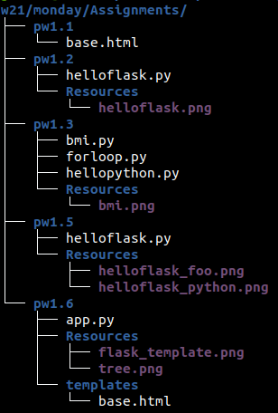

# Python weppipalvelu - Ideasta tuotantoon ICT8TN034-3001 | Joonas Kulmala

- [Python weppipalvelu - Ideasta tuotantoon ICT8TN034-3001 | Joonas Kulmala](#python-weppipalvelu---ideasta-tuotantoon-ict8tn034-3001--joonas-kulmala)
  - [Course description](#course-description)
  - [Prerequisities](#prerequisities)
  - [Acknowledgments](#acknowledgments)

## Course description

Welcome to **Python weppipalvelu**! This repository includes both lesson practices and course assignments.

This course is about Python and Flask framework. The end result, `Mini Project` will be a functional CRUD application deployed on a public server, which can be accessed here: http://joonaskulmala.me/

Mini Project is also available as a stand-alone GitHub repository on ___

All assigned & returned exercises can be found in each day's `/Assignments` directory, as seen on example picture below

`Python-weppipalvelu/w21/monday/Assignments`

## Prerequisities

`Python Dependencies`
* python3-flask
* python3-flask-sqlalchemy

Python 3 and Flask are required to run applications. Later exercises may require additional python dependencies to function.

For PIP use of `virtualenv` is strongly recommended when installing python dependencies. Additionally `virtualenvwrapper` is recommended for controlling these enviroments. 

Install dependencies for development enviroment:

	$ pip install -r requirements.txt

## Acknowledgments

This course is hosted by Tero Karvinen. The course website can be found here: [Python Web Service From Idea to Production](https://terokarvinen.com/2021/python-web-service-from-idea-to-production/)
