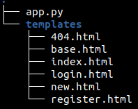
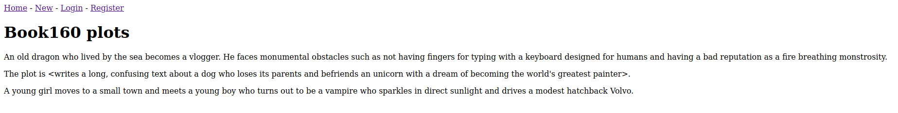
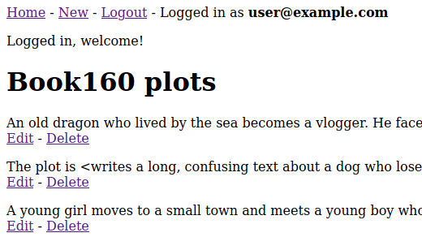
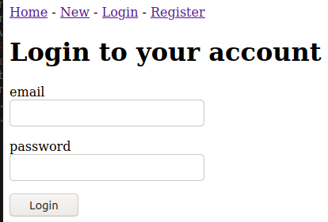
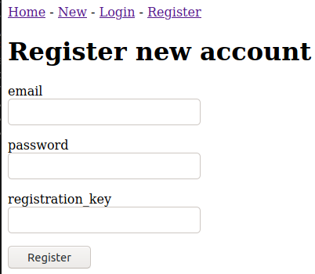

# w21 friday | Joonas Kulmala

- [w21 friday | Joonas Kulmala](#w21-friday--joonas-kulmala)
  - [Exercise goals & enviroment](#exercise-goals--enviroment)
  - [Exercises](#exercises)
    - [pw5.1 Book160](#pw51-book160)
      - [Code snippets](#code-snippets)
      - [Screenshots](#screenshots)
      - [Known issues](#known-issues)
    - [pw5.2 Projektin tarkoitus](#pw52-projektin-tarkoitus)
  - [Sources](#sources)
  - [Edit history](#edit-history)

## Exercise goals & enviroment

Flask application with fully functional CRUD (Create, Read, Update, Delete) methods.

## Exercises

All files are contained within subdirectories here: [Assignments](https://github.com/JoonasKulmala/Python-weppipalvelu/tree/main/w21/friday/Assignments).

### pw5.1 Book160

[Root directory](https://github.com/JoonasKulmala/Python-weppipalvelu/tree/main/w21/friday/Assignments/pw5.1)



CRUD application with account creation/login feature
* automatically generate database
* non-registered users are limited to Read
* registered users are not limited (full CRUD)
* account creation with validators

To run the application, navigate to root `Python-weppipalvelu/w21/friday/Assignments/pw5.1` and run with

    $ python3 app.py

#### Code snippets

Below are some code snippets

Generating database in `app.py`
```
class Plot(db.Model):
    id = db.Column(db.Integer, primary_key=True)
    plot = db.Column(db.Text(160), nullable=False)


class User(db.Model):
    id = db.Column(db.Integer, primary_key=True)
    email = db.Column(db.String, nullable=False)
    role = db.Column(db.String, default="user")
    passwordHash = db.Column(db.String, nullable=False)

    def setPassword(self, password):
        self.passwordHash = generate_password_hash(password)

    def checkPassword(self, password):
        return check_password_hash(self.passwordHash, password)
```

Registrating new account
```
@app.route("/register", methods=["GET", "POST"])
def registerView():
    form = RegisterForm()
    if form.validate_on_submit():
        # Needs to be hidden or validated elsewhere
        if form.key.data != "joonas":
            flash("Bad registration key.")
            return redirect("/register")
        user = User()
        user.email = form.email.data
        user.setPassword(form.password.data)
        db.session.add(user)
        db.session.commit()
        flash("Your new account has been created.")
        return redirect("/login")
    return render_template("register.html", form=form, button="Login")
```

#### Screenshots

Default view



Logged in view



Login



Register



#### Known issues

Book160 has known issues or lack of features:
* Edit, Delete methods are not restricted between users (anyone can E+D any post)
* Admin view not implemented

### pw5.2 Projektin tarkoitus

[Root directory](https://github.com/JoonasKulmala/Python-weppipalvelu/tree/main/w21/friday/Assignments/pw5.2)

Forum application where users can post new threads and then leave comments.

As per assignment the topic has been also been posted on [Comments](https://terokarvinen.com/2021/python-web-service-from-idea-to-production/#comments) at course website [Python Web Service From Idea to Production](https://terokarvinen.com/2021/python-web-service-from-idea-to-production/).

## Sources

Tero Karvinen - [Python Web Service From Idea to Production #pw5](https://terokarvinen.com/2021/python-web-service-from-idea-to-production/#pw5-users---kayttajat-ja-salasanat)

## Edit history
