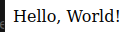
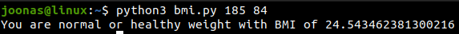
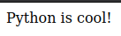
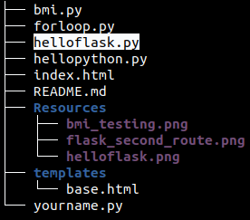
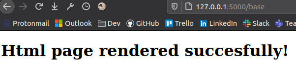

# w21 monday | Joonas Kulmala

- [w21 monday | Joonas Kulmala](#w21-monday--joonas-kulmala)
  - [Exercise goals & enviroment](#exercise-goals--enviroment)
  - [Exercises](#exercises)
    - [pw1.1 Hei HTML](#pw11-hei-html)
    - [pw1.2 Hei Flask](#pw12-hei-flask)
    - [pw1.3 Hei Python](#pw13-hei-python)
      - [hello world](#hello-world)
      - [for loop](#for-loop)
      - [BMI calculator with user input](#bmi-calculator-with-user-input)
    - [pw1.5 Kaksi reittiä](#pw15-kaksi-reittiä)
    - [pw1.6 base.html](#pw16-basehtml)
  - [Sources](#sources)
  - [Edit history](#edit-history)

## Exercise goals & enviroment

| Tool   | Version |
| ------ | ------- |
| Python | 3.8.5   |
| Flask  | 2.0.1   |

Simple introduction to Python and Flask.

Install Flask:

    $ sudo apt-get install python3-flask

## Exercises

### pw1.1 Hei HTML

Here is my simple HTML template `ìndex.html`, valitated by [NU Html Checker](https://validator.w3.org/nu/#textarea):

    <!DOCTYPE html>
    <html lang="en">

    <head>
        <meta charset="UTF-8">
        <meta name="viewport" content="width=device-width, initial-scale=1.0">
        <title>
            Title
        </title>

    </head>

    <body>
    </body>

    </html>

### pw1.2 Hei Flask

Basic *Hello World* Flask program `helloflask.py`:

    from flask import Flask
    app = Flask(__name__)

    @app.route("/")
    def hello():
        return "Hello, World!"

    app.run()

### pw1.3 Hei Python

#### hello world

Basic *Hello World* python program `hellopython.py`:

    print('Hello World!')

And some other examples of python:

#### for loop

`forloop.py`

    for i in range (1,10):
    	print(i)

#### BMI calculator with user input

`bmi.py`

    #!/usr/bin/python3

    import sys

    if len(sys.argv) < 2:
       sys.exit(
           "Please insert your height in centimeters (cm) and weight in kilograms (kg)")

    elif len(sys.argv) < 3:
        sys.exit('You forgot to insert your weight!')

    height = float(sys.argv[1])
    weight = float(sys.argv[2])
    bmi = weight / ((height*0.01)**2)

    if bmi < 18.5:
        print(f'You are underweight with BMI of {bmi}')

    elif bmi > 25:
       print(f'You are overweight with BMI of {bmi}')

    else:
        print(f'You are normal or healthy weight with BMI of {bmi}')

Testing:

    $ python3 bmi.py 185 84
    You are normal or healthy weight with BMI of 24.543462381300216

### pw1.5 Kaksi reittiä

Let's modify `helloflask.py` to return something from `127.0.0.1:5000/python`:

    from flask import Flask
    app = Flask(__name__)

    @app.route("/")
    def hello():
       return "Hello, World!"

    @app.route("/python")
    def hellosecondroute():
    	return "Python is cool!"

    app.run()

Now navigating `127.0.0.1:5000/python` returns "Python is cool!":

### pw1.6 base.html

Let's render a HTML file with Flask. I'll modify the existing `helloflask.py` and `index.html` files to save some time.

Starting with `helloflask.py`, we are going to import **render_template** and add endpoint which returns the HTML file to render:

    from flask import Flask, render_template
    app = Flask(__name__)

    @app.route("/")
    def hello():
        return "Hello, World!"

    @app.route("/python")
    def hellopython():
        return "Python is cool!"

    @app.route("/base")
    def base():
        return render_template("base.html")

    app.run()

Now `127.0.0.1:5000/base` returns `base.html`. By default flask looks for HTML files in `/templates` directory located in flask app's root.

    # Navigate to your flask app's directory
    $ cd /path/to/flask_app
    $ mkdir templates
    $ sudo cp index.html templates/base.html

I'll add a single paragraph so `base.html` has something to render besides blank space:

    <h1> Html page rendered succesfully!
    </h1>

Now running the Flask application and navigating to `127.0.0.1:5000/base` renders `templates/base.html`

## Sources

Tero Karvinen - [Python Web Service From Idea to Production #pw1 Hello Flask world!](https://terokarvinen.com/2021/python-web-service-from-idea-to-production/#pw1-hello-flask-world)

WC3 - [Markup Validation Service](https://validator.w3.org/#validate_by_input)

Julian Nash - [Serving HTML files | Learning Flask Ep. 3](https://pythonise.com/series/learning-flask/rendering-html-files-with-flask)

## Edit history
