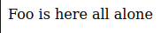

# w21 monday | Joonas Kulmala

- [w21 monday | Joonas Kulmala](#w21-monday--joonas-kulmala)
  - [Exercise goals & enviroment](#exercise-goals--enviroment)
  - [Exercises](#exercises)
    - [pw1.1 Hei HTML](#pw11-hei-html)
    - [pw1.2 Hei Flask](#pw12-hei-flask)
    - [pw1.3 Hei Python](#pw13-hei-python)
      - [hello world](#hello-world)
      - [for loop](#for-loop)
      - [BMI calculator with user input](#bmi-calculator-with-user-input)
    - [pw1.5 Kaksi reittiä](#pw15-kaksi-reittiä)
    - [pw1.6 base.html](#pw16-basehtml)
  - [Sources](#sources)
  - [Edit history](#edit-history)

## Exercise goals & enviroment

| Tool   | Version |
| ------ | ------- |
| Python | 3.8.5   |
| Flask  | 2.0.1   |

Simple introduction to Python and Flask.

Install Flask:

    $ sudo apt-get install python3-flask

## Exercises

All files are contained within subdirectories here: [Assignments](https://github.com/JoonasKulmala/Python-weppipalvelu/tree/main/w21/monday/Assignments)

### pw1.1 Hei HTML

[Root directory](https://github.com/JoonasKulmala/Python-weppipalvelu/tree/main/w21/monday/Assignments/pw1.1)

Here is my simple HTML template `base.html`, valitated by [NU Html Checker](https://validator.w3.org/nu/#textarea):

```
<!DOCTYPE html>
<html lang="en">

<head>
    <meta charset="UTF-8">
    <meta name="viewport" content="width=device-width, initial-scale=1.0">
    <title>
        Title
    </title>

</head>

<body>
</body>

</html>
```

### pw1.2 Hei Flask

[Root directory](https://github.com/JoonasKulmala/Python-weppipalvelu/tree/main/w21/monday/Assignments/pw1.2)

Basic Hello World Flask program `helloflask.py`:

```
from flask import Flask
app = Flask(__name__)


@app.route("/")
def hello():
    return "Hello, World!"


app.run()
```

In browser


### pw1.3 Hei Python

[Root directory](https://github.com/JoonasKulmala/Python-weppipalvelu/tree/main/w21/monday/Assignments/pw1.3)

#### hello world

Basic Hello World Python program `hellopython.py`:

    print('Hello World!')

And some other examples of python:

#### for loop

For loop `forloop.py`

    for i in range (1,10):
    	print(i)

#### BMI calculator with user input

More advanced python program with *IF...ELIF...ELSE* statements `bmi.py` which calculates body mass index and returns value and 1 of 3 outcomes

```
#!/usr/bin/python3

import sys

if len(sys.argv) < 2:
    sys.exit(
        "Please insert your height in centimeters (cm) and weight in kilograms (kg)")

elif len(sys.argv) < 3:
    sys.exit('You forgot to insert your weight!')

height = float(sys.argv[1])
weight = float(sys.argv[2])
bmi = weight / ((height*0.01)**2)

if bmi < 18.5:
    print(f'You are underweight with BMI of {bmi}')

elif bmi > 25:
    print(f'You are overweight with BMI of {bmi}')

else:
    print(f'You are normal or healthy weight with BMI of {bmi}')
```

Testing the program

    $ python3 bmi.py 185 84
    You are normal or healthy weight with BMI of 24.543462381300216


### pw1.5 Kaksi reittiä

[Root directory](https://github.com/JoonasKulmala/Python-weppipalvelu/tree/main/w21/monday/Assignments/pw1.5)

Let's modify `helloflask.py` to return something from two different endpoints:
* `127.0.0.1:5000/python`
* `127.0.0.1:5000/foo`

```
from flask import Flask, render_template
app = Flask(__name__)


@app.route("/")
def hello():
    return "Hello, World!"


@app.route("/python")
def python():
    return "Python is cool!"


@app.route("/foo")
def foo():
    return ("Foo is here all alone")


app.run()
```

Now `127.0.0.1:5000/python` returns


And `127.0.0.1:5000/foo` returns



### pw1.6 base.html

[Root directory](https://github.com/JoonasKulmala/Python-weppipalvelu/tree/main/w21/monday/Assignments/pw1.6)

Flask app's endpoints can return HTML files to render.

Starting with `app.py`, we are going to import module **render_template** and add endpoint which returns the HTML file to render:

```
from flask import Flask, render_template
app = Flask(__name__)


@app.route("/")
def base():
    return render_template("base.html")


app.run()
```

Running the application now returns `base.html`. Flask looks for HTML files in `/templates` directory located in application's root directory.


Let's create `templates/base.html` file

```
<!DOCTYPE html>
<html lang="en">

<head>
    <meta charset="UTF-8">
    <meta name="viewport" content="width=device-width, initial-scale=1.0">
    <title>
        Title
    </title>

</head>

<body>
    <h3>Flask template rendering seems cool</h3>
</body>

</html>
```

Now running the Flask application and navigating to `127.0.0.1:5000` renders `templates/base.html`


## Sources

Tero Karvinen - [Python Web Service From Idea to Production #pw1 Hello Flask world!](https://terokarvinen.com/2021/python-web-service-from-idea-to-production/#pw1-hello-flask-world)

WC3 - [Markup Validation Service](https://validator.w3.org/#validate_by_input)

Julian Nash - [Serving HTML files | Learning Flask Ep. 3](https://pythonise.com/series/learning-flask/rendering-html-files-with-flask)

## Edit history

27.05.2021
* Fixed file permissions
* Cleaned code

29.05.2021
* Restructured project root directory
* Renamed python files to more neutral names
