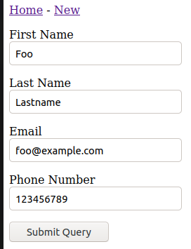
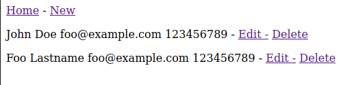
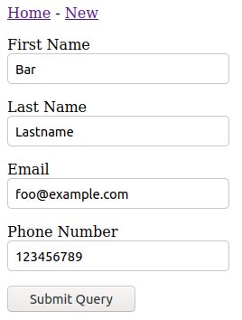
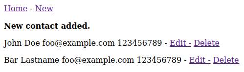
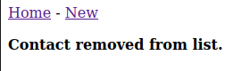
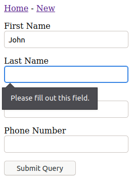
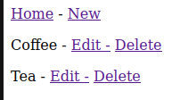
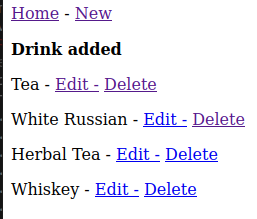

# w21 thursday | Joonas Kulmala

- [w21 thursday | Joonas Kulmala](#w21-thursday--joonas-kulmala)
  - [Exercise goals & enviroment](#exercise-goals--enviroment)
  - [Exercises](#exercises)
    - [pw4.1 Osoitekirja](#pw41-osoitekirja)
    - [pwd4.3](#pwd43)
  - [Sources](#sources)
  - [Edit history](#edit-history)

## Exercise goals & enviroment

| Tool   | Version |
| ------ | ------- |
| Python | 3.8.5   |
| Flask  | 2.0.1   |

Flask CRUD application, automatic form & database creation.

## Exercises

All files are contained within subdirectories here: [Assignments](https://github.com/JoonasKulmala/Python-weppipalvelu/tree/main/w21/thursday/Assignments).

### pw4.1 Osoitekirja

CRUD application that saves the following information to database:
* id
* first name
* last name
* email
* phone number

I was unable to validate data types.

`app.py`
```
from flask import Flask, render_template, redirect, flash
from flask_sqlalchemy import SQLAlchemy
from flask_wtf import FlaskForm
from wtforms.ext.sqlalchemy.orm import model_form


app = Flask(__name__)
app.secret_key = "Eere3Wie5amei3wae5Ey"
db = SQLAlchemy(app)


class Contact(db.Model):
    id = db.Column(db.Integer, primary_key=True)
    first_name = db.Column(db.String, nullable=False)
    last_name = db.Column(db.String, nullable=False)
    email = db.Column(db.String, nullable=False)
    phone_number = db.Column(db.Integer, nullable=False)


ContactForm = model_form(Contact, base_class=FlaskForm, db_session=db.session)


@app.before_first_request
def initDb():
    db.create_all()

    contact = Contact(first_name="John", last_name="Doe",
                      email="foo@example.com", phone_number="123456789")
    db.session.add(contact)

    db.session.commit()


@app.route("/<int:id>/delete")
def deleteContact(id):
    contact = Contact.query.get_or_404(id)
    db.session.delete(contact)
    db.session.commit()

    flash("Contact removed from list.")
    return redirect("/")


@app.route("/<int:id>/edit", methods=["GET", "POST"])
@app.route("/new", methods=["GET", "POST"])
def newContact(id=None):
    contact = Contact()
    if id:
        contact = Contact.query.get_or_404(id)

    form = ContactForm(obj=contact)

    if form.validate_on_submit():
        form.populate_obj(contact)

        db.session.add(contact)
        db.session.commit()

        flash("New contact added.")
        return redirect("/")

    return render_template("new.html", form=form)


@app.route("/")
def index():
    contacts = Contact.query.all()
    return render_template("index.html", contacts=contacts)


if __name__ == "__main__":
    app.run()
```

`base.html`
```




<!doctype html>
<html lang=en>

<head>
	<title>
		{{ title }}
	</title>
	<meta charset="utf-8">
	<meta name=viewport content="width=device-width, initial-scale=1">
</head>

<body>

	<nav>
		<a href="/">Home</a> -
		<a href="/new">New</a>
	</nav>

	
	<p><b>{{ msg }}</b></p>
	

	

	
</body>

</html>
```

`index.html`
```






<p>{{ contact.first_name }} {{ contact.last_name }} {{ contact.email }} {{ contact.phone_number }} -
    <a href="{{ contact.id }}/edit">Edit -</a>
    <a href="{{ contact.id }}/delete">Delete</a>
</p>



```

`new.html`
```





<form method=POST>
    
    <p>
        
        {{ field.label }} <br>
        
        {{ field (class="form-control-lg is-invalid") }}
    </p>
    
    <input type=submit>
</form>


```

Run the application with

    $ python3 app.py

Here are the CRUD functions:

Create



Read



Update





Delete



Also added a warning when trying to submit a form without sufficient data:



### pwd4.3

Here's my initial Flask CRUD application. It's somewhat more simplistic than the previous app: [pw4.3](https://github.com/JoonasKulmala/Python-weppipalvelu/tree/main/w21/thursday/Assignments/pw4.3)





## Sources

Tero Karvinen - [Python Web Service From Idea to Production #pw4](https://terokarvinen.com/2021/python-web-service-from-idea-to-production/#pw4-crud---kokonainen-tietokantaohjelma-wepissa)


## Edit history