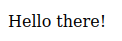
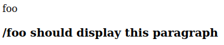
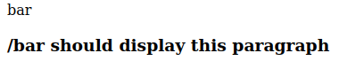
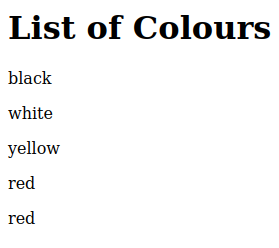

# w21 tuesday | Joonas Kulmala

- [w21 tuesday | Joonas Kulmala](#w21-tuesday--joonas-kulmala)
  - [Exercise goals & enviroment](#exercise-goals--enviroment)
  - [Exercises](#exercises)
    - [pw2.1 Muuttuja muottiin](#pw21-muuttuja-muottiin)
    - [pw2.2 Tuplamuuttuja](#pw22-tuplamuuttuja)
    - [pw2.3 Toista tätä, toista tätä](#pw23-toista-tätä-toista-tätä)
  - [Sources](#sources)
  - [Edit history](#edit-history)

## Exercise goals & enviroment

| Tool   | Version |
| ------ | ------- |
| Python | 3.8.5   |
| Flask  | 2.0.1   |

Flask and HTML templating.

## Exercises

All files are contained within subdirectories here: [Assignments](https://github.com/JoonasKulmala/Python-weppipalvelu/tree/main/w21/tuesday/Assignments).

### pw2.1 Muuttuja muottiin

A variable needs to be rendered in HTML. Let's declare a variable in flask app and make that happen.

In the flask application `app.py`, simply declare variable *greeting* and instruct HTML file what to render.

```
from flask import Flask, render_template
app = Flask(__name__)


@app.route("/")
def base():
    greeting = "Hello there!"
    return render_template("base.html", name=greeting, greeting=greeting)


app.run()
```

Next up instruct `base.html` where to render the variable - note the line `<p>{{ greeting }}</p>`

 ```
  <!DOCTYPE html>
<html lang="en">

<head>
  <meta charset="UTF-8">
  <meta name=viewport content "width=device-width; initial-scale=1" <title>
  

  

  

  
  </title>
  <style>
  </style>
</head>

<body>
  <article>
    
    <p>{{ greeting }}</p>
    
  </article>
</body>

</html>
 ```

 Now run the application and open browser:

    $ python3 app.py



### pw2.2 Tuplamuuttuja

Templating HTML files. No point creating each HTML from the scratch when we can just use the base boilerplate over and over again.

Let's add some functionality to `app.py` by having endpoints **/foo** and **/bar** redirect to corresponding HTML files

```
from flask import Flask, render_template
app = Flask(__name__)


@app.route("/")
def base():
    return render_template("base.html")


@app.route("/foo")
def foo():
    return render_template("foo.html")


@app.route("/bar")
def bar():
    return render_template("bar.html")


app.run()
```

Empty template HTML `base.html` where content rendering has been assigned

```
<!DOCTYPE html>
<html lang="en">

<head>
  <meta charset="UTF-8">
  <meta name=viewport content "width=device-width; initial-scale=1" <title>
  

  

  

  
  </title>
  <style>
  </style>
</head>

<body>
  <article>
    

    
  </article>
</body>

</html>
```

Next up `foo.html` and `bar.html` files which **extend** `base.html`

```



foo



<h3>/foo should display this paragraph</h3>

```


```



bar



<h3>/bar should display this paragraph</h3>

```


### pw2.3 Toista tätä, toista tätä

Let's render a list of colours in an array.

```
from flask import Flask, render_template
app = Flask(__name__)


@app.route("/")
def base():
    return render_template("base.html")


@app.route("/colours")
def colours():
    colours = ["black", "white", "yellow", "red", "red"]
    return render_template("colours.html", name="Colours", colours=colours)


app.run()
```

Using the same `base.html` template as previously, let's create extending file `colours.html`

```




<h1> List of {{ name }}</h1>





<p>{{ colour }}</p>



```



## Sources

Tero Karvinen - [Python Web Service From Idea to Production #pw2](https://terokarvinen.com/2021/python-web-service-from-idea-to-production/#pw2-muotit-ja-lomakkeet)

## Edit history