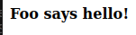
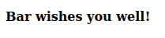
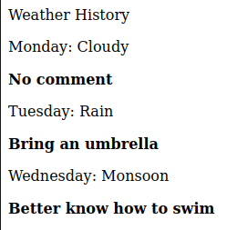
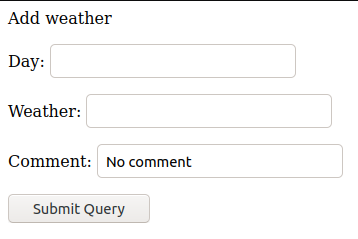

# w21 wednesday | Joonas Kulmala

- [w21 wednesday | Joonas Kulmala](#w21-wednesday--joonas-kulmala)
  - [Exercise goals & enviroment](#exercise-goals--enviroment)
  - [Exercises](#exercises)
    - [pw3.1 Flash](#pw31-flash)
    - [pw3.2 Automaattinen tietokanta ja lomake](#pw32-automaattinen-tietokanta-ja-lomake)
  - [Sources](#sources)
  - [Edit history](#edit-history)

## Exercise goals & enviroment

| Tool   | Version |
| ------ | ------- |
| Python | 3.8.5   |
| Flask  | 2.0.1   |

Flash messages, ORN form, database.

## Exercises

All files are contained within subdirectories here: [Assignments](https://github.com/JoonasKulmala/Python-weppipalvelu/tree/main/w21/wednesday/Assignments).

### pw3.1 Flash

Two different URL endpoints must each send a flash message to root endpoint.

Few interesting points here:
* app.secret_key must be included
* flash message endpoints redirect back to `base.html`

`app.py`
```
from flask import Flask, render_template, redirect, flash
app = Flask(__name__)

app.secret_key = b"jXef7J2hirwCA8DW9CxIdHm88wJhvY"


@app.route("/")
def index():
    return render_template("index.html")


@app.route("/foo")
def fooMsg():
    flash("Foo says hello!")
    return redirect("/")


@app.route("/bar")
def barMsg():
    flash("Bar wishes you well!")
    return redirect("/")


if __name__ == "__main__":
    app.run()
```

`base.html`
```
<!DOCTYPE html>
<html lang=en>

<head>
	<title>
		Title
	</title>
	<meta charset="utf-8">
</head>

<body>
	

	
</body>

</html>
```

`index.html`
```





<p><b>{{ message }}</b></p>




<p>{{ comment.name }}: {{ comment.text }}</p>


```

Now running the app and navigating to endpoints **/foo** and **/bar** will send flash messages and redirect back to beginning:

    $ python3 app.py





### pw3.2 Automaattinen tietokanta ja lomake

Automatically create database + form when running the application.

Break it down to 4 components:
* `app.py` flask app creates database and form, declares endpoints and so on
* `base.html` base template
* `index.html` child template for rendering database entries (hard coded)
* `new.html` form for loops a text box for each database class' variable

`app.py`
```
from flask import Flask, render_template, request
from flask_sqlalchemy import SQLAlchemy

from flask_wtf import FlaskForm
from wtforms.ext.sqlalchemy.orm import model_form

app = Flask(__name__)
app.secret_key = b"dppoi96cc.eeoe98"  # pwgen -1 20
db = SQLAlchemy(app)


class WeatherForecast(db.Model):
    id = db.Column(db.Integer, primary_key=True)
    day = db.Column(db.String, nullable=False)
    weather = db.Column(db.String, nullable=False)
    comment = db.Column(db.String, default="No comment")


CommentForm = model_form(
    WeatherForecast, base_class=FlaskForm, db_session=db.session)


@app.before_first_request
def initMe():
    db.create_all()

    weather = WeatherForecast(
        day="Monday", weather="Cloudy")
    db.session.add(weather)

    weather = WeatherForecast(
        day="Tuesday", weather="Rain", comment="Bring an umbrella")
    db.session.add(weather)

    weather = WeatherForecast(
        day="Wednesday", weather="Monsoon", comment="Better know how to swim")
    db.session.add(weather)

    db.session.commit()


@app.route("/new", methods=["GET", "POST"])
def addForm():
    form = CommentForm()
    print(request.form)
    return render_template("new.html", form=form)


@app.route("/")
def index():
    weathers = WeatherForecast.query.all()
    return render_template("index.html", weathers=weathers)


if __name__ == "__main__":
    app.run()
```

`base.html`
```
<!doctype html>
<html lang=en>

<head>
	<title>
		 
	</title>
	<meta charset="utf-8">
</head>

<body>
	

	
</body>

</html>
```

`index.html`
```

Weather History






<p>{{ weather.day }}: {{ weather.weather }}</p>
<p><b>{{ weather.comment }}</b></p>


```

`new.html`
```

Add weather






<form method=POST>
    
    
    <p>{{ field.label }}: {{ field }}</p>
    
    
    <input type="submit">
</form>

```

End results look like this:





## Sources

Tero Karvinen - [Python Web Service From Idea to Production #pw3](https://terokarvinen.com/2021/python-web-service-from-idea-to-production/#pw3-orm---luokista-lomakkeet-ja-tietokannat)

## Edit history