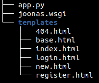

# w22 monday | Joonas Kulmala

- [w22 monday | Joonas Kulmala](#w22-monday--joonas-kulmala)
- [Exercise goals & enviroment](#exercise-goals--enviroment)
  - [Exercises](#exercises)
    - [pw6.1](#pw61)
      - [Creating UNIX user for deployment](#creating-unix-user-for-deployment)
      - [Creating WSGI config files](#creating-wsgi-config-files)
    - [pw6.2](#pw62)
  - [Sources](#sources)
  - [Edit history](#edit-history)

# Exercise goals & enviroment

| Tool   | Version |
| ------ | ------- |
| Python | 3.8.5   |
| Flask  | 2.0.1   |

Connecting Flask application to database, deployment using WSGI module.

## Exercises

All files are contained within subdirectories here: [Assignments](https://github.com/JoonasKulmala/Python-weppipalvelu/tree/main/w22/monday/Assignments)

This assignment is functional and usable at my domain [joonaskulmala.me](http://joonaskulmala.me/).


### pw6.1

[Root directory](https://github.com/JoonasKulmala/Python-weppipalvelu/tree/main/w22/monday/Assignments/pw6.1)

There's a few steps in order to properly deploy a flask application
* build application (basic hello world will do, this exercise uses CRUD application)
* install & configure web server (e.g. Apache2)

So let's get started.

#### Creating UNIX user for deployment

Let's create a new UNIX user, set permissions to its folders and disable login use for security reasons.

```
# User for deployment, creates both user & role under given name
$ sudo useradd joonaswsgi
# Create a directory for Flask application in new user's home directory
$ sudo mkdir /home/joonaswsgi/public_wsgi
# Change directory ownership to include target group
$ sudo chown joonaswsgi:joonaswsgi public_wsgi/
# Add permission to modify this directory for group members
$ sudo chmod -r g+rw public_wsgi
# Lock the new user
$ sudo usermod --lock joonaswsgi
```

Now any user who is granted group **joonaswsgi** can read+write `/home/joonaswsgi/public_wsgi` directory. Don't forget to add yourself.

#### Creating WSGI config files

Now we need files to configure what and how to deploy Flask application. Apache2 is needed for this part - install it with `$ sudo apt-get install apache2`.

In `/etc/apache2/sites-available`
```
# apache2 conf file
$ touch joonaswsgi.conf

<VirtualHost *:80>
    WSGIDaemonProcess joonaswsgi user=joonaswsgi group=joonaswsgi threads=5
    WSGIScriptAlias / /home/joonaswsgi/public_wsgi/joonas.wsgi
    <Directory /home/joonaswsgi/public_wsgi/>
	WSGIScriptReloading On
	WSGIProcessGroup joonaswsgi
	WSGIApplicationGroup %{GLOBAL}
	Require all granted
    </Directory>
</VirtualHost>
```

You can enable this `.conf` now or later when you're ready

```bash
$ sudo a2ensite joonaswsgi.conf
```

Now head to `/home/joonaswsgi/public_wsgi`. This is where Flask application as well as `.wsgi` configuration file will be.



Flask application `app.py`, full code is [here](Assignments/pw6.1/Book160/app.py). Note that in line **X** you have to set your own registration key

```py
if form.key.data != "your_key_name":
```

```py
from flask import Flask, render_template, flash, redirect, session, abort, request
...
// rest of the code
```

HTLM pages `/templates`...

And `joonas.wsgi` configuration file. In the last row, *from **app** import*... is the name of your flask application

```
import sys

assert sys.version_info.major == 3
sys.path.insert(0, '/home/joonaswsgi/public_wsgi/')

from app import app as application
```

You might need to enable the apache2 wsgi `conf` file and restart the daemon depending on earlier actions

```bash
$ sudo a2ensite joonaswsgi.conf
$ sudo systemctl restart apache2
```

After that navigate to your server's IP or domain - mine's [joonaskulmala.me](http://joonaskulmala.me/)


And here we are - fully functional Flask CRUD application with Postgres database.

### pw6.2

[Root directory](https://github.com/JoonasKulmala/Python-weppipalvelu/tree/main/w22/monday/Assignments/pw6.2)

This task is just instruction to keep working on the mini project, so there's nothing to be reported really.

If I had to summarize my topic it'd be *Poor Man's Reddit*. I'll be developing Flask CRUD application which resembles a forum where you can post new threads and then leave comments in those.

## Sources

Tero Karvinen - [Python Web Service From Idea to Production #pw6](https://terokarvinen.com/2021/python-web-service-from-idea-to-production/#pw6-deploy---tuotantoasennus)

## Edit history

01.06.2021
* Assignment pw6.1 successful, edited
