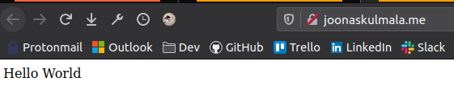

# w22 monday | Joonas Kulmala

# Exercise goals & enviroment

Connecting Flask application to database, deployment using WSGI module.

## Exercises

All files are contained within subdirectories here: [Assignments](https://github.com/JoonasKulmala/Python-weppipalvelu/tree/main/w22/monday/Assignments)

This task was only partially successful. I was able to to deploy a basic Hello World Flask application using WSGI and it can be seen here on my public domain: [joonaskulmala.me](http://joonaskulmala.me/)

However, when trying to deploy my actual Flask application following Tero's guides and best practices I encountered an obstacle that I was unable to get around.

```
[Tue Jun 01 00:47:30.867393 2021] [wsgi:error] [pid 9672:tid 139903838435072] [remote 88.113.8.106:57838] Traceback (most recent call last):
[Tue Jun 01 00:47:30.867431 2021] [wsgi:error] [pid 9672:tid 139903838435072] [remote 88.113.8.106:57838]   File "/home/joonaswsgi/public_wsgi/joonas.wsgi", line 10, in <module>
[Tue Jun 01 00:47:30.867435 2021] [wsgi:error] [pid 9672:tid 139903838435072] [remote 88.113.8.106:57838]     from app import app as application
[Tue Jun 01 00:47:30.867441 2021] [wsgi:error] [pid 9672:tid 139903838435072] [remote 88.113.8.106:57838]   File "/home/joonaswsgi/public_wsgi/app.py", line 3, in <module>
[Tue Jun 01 00:47:30.867445 2021] [wsgi:error] [pid 9672:tid 139903838435072] [remote 88.113.8.106:57838]     from flask_wtf import FlaskForm
[Tue Jun 01 00:47:30.867459 2021] [wsgi:error] [pid 9672:tid 139903838435072] [remote 88.113.8.106:57838] ModuleNotFoundError: No module named 'flask_wtf'
```

There's something wrong with importing python modules. This is probably connected to trying to deploy as another user **joonaswsgi**. I'll return to complete this task once I consult for more information.

### pw6.1

[Root directory](https://github.com/JoonasKulmala/Python-weppipalvelu/tree/main/w22/monday/Assignments/pw6.1)

There's a few steps in order to properly deploy a flask application
* build application (basic hello world will do)
* install & configure web server (e.g. Apache2)

So let's get started.

#### Creating UNIX user for deploying

Let's create a new UNIX user, set permissions to its folders and disable login use for security reasons.

```
# User for deployment, creates both user & role under given name
$ sudo useradd joonaswsgi
# Create a directory for Flask application in new user's home directory
$ sudo mkdir /home/joonaswsgi/public_wsgi
# Change directory ownership to target group
$ sudo chown joonaswsgi:joonaswsgi public_wsgi/
# Add permission to modify this directory for group members
$ sudo chmod -r g+rw public_wsgi
# Lock the new user
$ sudo usermod --lock joonaswsgi
```

Now anyone who is granted **group** role **joonaswsgi** can read+write `/home/joonaswsgi/public_wsgi` directory. Don't forget to add yourself to that group.

#### Creating WSGI config files

Now we need files to configure what and how to deploy Flask application. Apache2 is needed for this part - install it with `$ sudo apt-get install apache2`.

In `/etc/apache2/sites-available`
```
# apache2 conf file
$ touch joonaswsgi.conf

<VirtualHost *:80>
    WSGIDaemonProcess joonaswsgi user=joonaswsgi group=joonaswsgi threads=5
    WSGIScriptAlias / /home/joonaswsgi/public_wsgi/joonas.wsgi
    <Directory /home/joonaswsgi/public_wsgi/>
	WSGIScriptReloading On
	WSGIProcessGroup joonaswsgi
	WSGIApplicationGroup %{GLOBAL}
	Require all granted
    </Directory>
</VirtualHost>

# Enable conf
$ sudo a2ensite joonaswsgi.conf
```

Next up, head to previously created directory `/home/joonaswsgi/public_wsgi` and create `hello.py`
```
# Flask application, note lack of app.run()
$ touch hello.py

from flask import Flask

app = Flask(__name__)

@app.route("/")
def hello():
	return "Hello World"
```

And then `joonas.wsgi` config file
```
$ touch joonas.wsgi

import sys

assert sys.version_info.major == 3
sys.path.insert(0, '/home/joonaswsgi/public_wsgi/')

from hello import app as application
```

You might need to enable the apache2 config file with `sudo a2ensite joonaswsgi.conf` and restart the daemon with `sudo systemctl restart apache2`.

After that navigate to your server's IP or domain - mine's [joonaskulmala.me](http://joonaskulmala.me/)



Production deployment was a success. However as stated in the beginning I had some issues deploying a fully developed Flask application.

### pw6.2

[Root directory](https://github.com/JoonasKulmala/Python-weppipalvelu/tree/main/w22/monday/Assignments/pw6.2)

This task is just instruction to keep working on the mini project, so there's nothing to be reported really.

If I had to summarize my topic it'd be *Poor Man's Reddit*. I'll be developing Flask CRUD application which resembles a forum where you can post new threads and then leave comments in those.

## Sources

Tero Karvinen - [Python Web Service From Idea to Production #pw6](https://terokarvinen.com/2021/python-web-service-from-idea-to-production/#pw6-deploy---tuotantoasennus)

## Edit history
